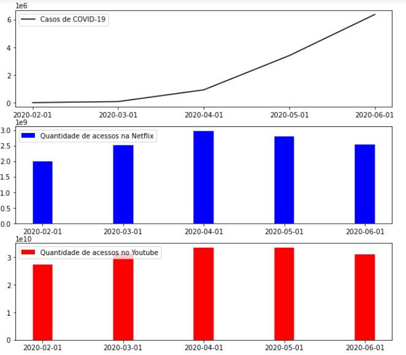

<h1><b>
Case
</b></h1>

Selecione 2 APIs, 1 de coronavírus e outra livre que você quera usar do <a href="https://coronavirus-map.p.rapidapi.com/v1/spots/summary">RapidAPI</a>. 
Pegar os dados com python-flask e salve esses dados em alguma base de dados que preferir para depois nos mostrar um relatório com gráficos da comparação de dados.

<b>
Códigos disponível em: <a href="https://github.com/yguenka/Campus_Inc_Case/blob/master/Campus%20Inc.ipynb">Campus_Inc_Case.ipynb</a>
</b>

Dados: COVID-19

Dados: Quantidades de acessos na Netflix

Dados: Quantidades de acessos no Youtube

<b>
As datas que estão no gráfico (primeiro dia de cada mês), faz referência da somatória do próprio mês. Por exemplo: a soma dos casos de COVID-19 do mês de Março, estão na linha do dia 1º de de Março.

Ao comparar os 3 gráficos, podemos observar que de durante o mês de abril,teve uma alta na quantidade de acesso tanto na Netflix quanto no Youtube (quando começou a quarentena em alguns países). Mesmo as pessoas do mundo inteiro acessando mais as plataformas digitais e estando de quarentena, os casos de COVID-19 aumentaram de forma exponencial.
</b>

<b>
Para fazer uma comparação melhorentre Netflix e Youtube, foi feito o gráfico abaixo no <a href="https://public.tableau.com/profile/yukari.guenka.yshida#!/vizhome/Campus_Inc_Case/Comparao">Tableau Public</a>. 
Neste gráfico, foi possível observar com mais clareza que no mês de maio, a quantidade de acessos da Netflix teve uma queda em relação ao mês anterior, enquanto o no Youtube, a quantidade de acessos aumentou. Podemos suspeitar que o aumento de acessos no Youtube durante o mês de maio foi devido as lives realizadas pelos artistas, além dos cursos gratuitos que estão sendo oferecidos pelos profissionais que estão de quarentena.
</b>

Dados: Países que acessam mais a Netflix no mês de junho

Dados: Países que mais acessam o Youtube no mês de junho

<b>
A partir dos dados obtidos pelo API, mostra a porcentagem de acessos por país nas duas plataformas.Em ambas as plataformas, podemos observar que mais de 20% dos acessos são dos EUA. A parte curiosa é que mesmo sendo uma plataforma paga, o Brasil é o segundo país que mais acessa a plataforma da Netflix.
</b>

<b>
Abaixo, foi feito dois mapas no Tableau Public sobre os países que mais acessam o <a href="https://public.tableau.com/profile/yukari.guenka.yshida#!/vizhome/Campus_Inc_Youtube/Youtube-Pases">Youtube</a> e a<a href="https://public.tableau.com/profile/yukari.guenka.yshida#!/vizhome/Campus_Inc_Case_Netflix/Netflix-Paises">Netflix</a>. Nele, fica mais claro obervar que os EUA, Brasil e Reino Unido estão entre os países que mais acessam as duas plataformas.
</b>

