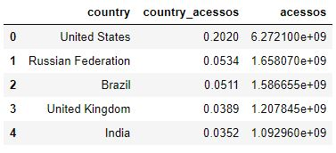

<h1><b>
Case
</b></h1>

Selecione 2 APIs, 1 de coronavírus e outra livre que você quera usar do <a href="https://coronavirus-map.p.rapidapi.com/v1/spots/summary">RapidAPI</a>. 
Pegar os dados com python-flask e salve esses dados em alguma base de dados que preferir para depois nos mostrar um relatório com gráficos da comparação de dados.

<u>
Dados: COVID-19
</u>

<u>
Dados: Quantidades de acessos na Netflix
</u>

<u>
Dados: Quantidades de acessos no Youtube
</u>

<b>
As datas que estão no gráfico (primeiro dia de cada mês), faz referência da somatória do mês anterior. Por exemplo: a soma dos casos de COVID-19 do mês de Março, estão na linha do dia 1º de Abril.

Ao comparar os 3 gráficos, podemos observar que de durante o mês de março (simbolizado pelo dia 1º de Abril),teve uma alta na quantidade de acesso tanto na Netflix quanto no Youtube (quando começou a quarentena). Mesmo as pessoas do mundo inteiro acessando mais as plataformas digitais, os casos de COVID-19 aumentaram de forma exponencial.
</b>

<b>
Para fazer uma comparação melhorentre Netflix e Youtube, foi feito o gráfico abaixo no <a href="https://public.tableau.com/profile/yukari.guenka.yshida#!/vizhome/Campus_Inc_Case/Painel1?publish=yes">Tableau Public</a>. 
Neste gráfico, foi possível observar com mais clareza que no mês de abril (datada no dia 1º de maio), a quantidade de acessos da Netflix teve uma queda em relação ao mês anterior, enquanto o no Youtube, a quantidade de acessos aumentou .
</b>

<u>
Dados: Países que acessam mais a Netflix
</u>

<u>
Dados: Países que mais acessam o Youtube
</u>

