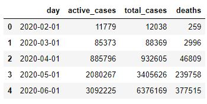

<h1><b>
Case
</b></h1>

Selecione 2 APIs, 1 de coronavírus e outra livre que você quera usar do <a href="https://coronavirus-map.p.rapidapi.com/v1/spots/summary">RapidAPI</a>. 
Pegar os dados com python-flask e salve esses dados em alguma base de dados que preferir para depois nos mostrar um relatório com gráficos da comparação de dados.

Dados do COVID-19

